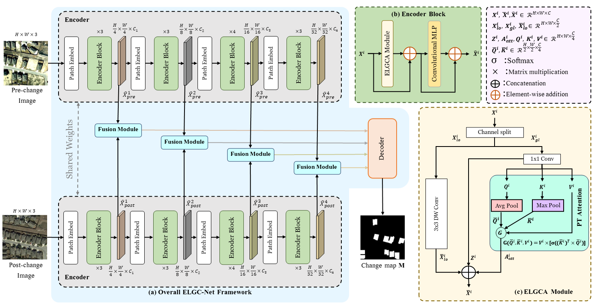
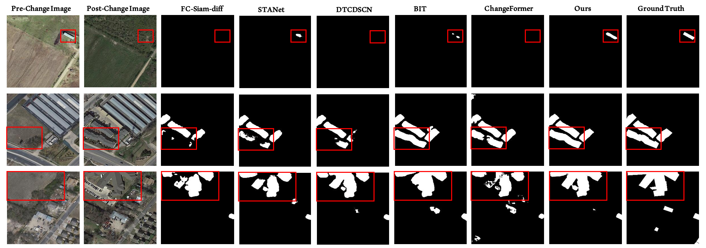

# ELGC-Net: Efficient Local-Global Context Aggregation for Remote Sensing Change Detection

[[IEEE TGRS]](https://ieeexplore.ieee.org/abstract/document/10423067) [[arXiv]](https://arxiv.org/abs/2403.17909)

This repo contains the official **PyTorch** code for Efficient Local-Global Context Aggregation for Remote Sensing Change Detection.

- **Code is released.**
- **Model weights are uplodaded.**

Highlights
-----------------
- **Rich Contextual Information:** Our proposed solution for remote sensing change detection (CD) is called ELGC-Net, which leverages rich contextual information to estimate change regions while reducing the model size precisely.
- **Hybrid Attention:** Our ELGCA module proposes to capture both local and global relationships through depthwise convolution and pooled transpose attention, respectively, while reducing computational complexity.
- **Experiments:** Our extensive experiments on three CD datasets demonstrate the robustness and efficiency of our approach while
achieving state-of-the-art performance.

Methods
-----------------


Introduction
-----------------
Deep learning has shown remarkable success in remote sensing change detection (CD), aiming to identify semantic change regions between co-registered satellite image pairs acquired at distinct time stamps. However, existing convolutional neural networks (CNN) and transformer-based frameworks often struggle to  accurately segment semantic change regions.  Moreover, transformers-based methods with standard self-attention suffer from quadratic computational complexity with respect to the image resolution, making them less practical for CD tasks with limited training data. To address these issues, we propose an efficient change detection framework, ELGC-Net, which leverages rich contextual information to precisely estimate change regions while reducing the model size. Our ELGC-Net comprises a Siamese encoder, fusion modules, and a decoder. The focus of our design is the introduction of an Efficient Local-Global Context Aggregator (ELGCA) module within the encoder, capturing enhanced global context and local spatial  information through a novel pooled-transpose (PT) attention and depthwise convolution, respectively. The PT attention employs  pooling operations for robust feature extraction and minimizes computational cost with transposed attention. Extensive experiments on three challenging CD datasets demonstrate that ELGC-Net outperforms existing methods. Compared to the recent transformer-based CD approach (ChangeFormer), ELGC-Net achieves a 1.4% gain in intersection over union (IoU) metric on the LEVIR-CD dataset, while significantly reducing trainable parameters. Our proposed ELGC-Net sets a new state-of-the-art performance in remote sensing change detection benchmarks.  Finally, we also introduce ELGC-Net-LW, a  lighter variant with significantly reduced computational complexity,   suitable for resource-constrained settings, while achieving comparable performance.

Quantitative Comparison 
-----------------


Visualization results over LEVIR-CD
-----------------


### Requirements
```
Python 3.8.0
pytorch 1.10.1
torchvision 0.11.2
einops  0.3.2
```

Please see `requirements.txt` for all the other requirements.

### :speech_balloon: Dataset Preparation

### :point_right: Data structure

```
"""
Change detection data set with pixel-level binary labels；
├─A
├─B
├─label
└─list
"""
```

`A`: images of t1 phase;

`B`:images of t2 phase;

`label`: label maps;

`list`: contains `train.txt, val.txt and test.txt`, each file records the image names (XXX.png) in the change detection dataset.

### Model Weights
Find the model weights [here](https://huggingface.co/mubashir04/elgcnet)

## Citation

```
@article{noman2024elgc,
  title={ELGC-Net: Efficient Local-Global Context Aggregation for Remote Sensing Change Detection},
  author={Noman, Mubashir and Fiaz, Mustansar and Cholakkal, Hisham and Khan, Salman and Khan, Fahad Shahbaz},
  journal={IEEE Transactions on Geoscience and Remote Sensing},
  year={2024},
  publisher={IEEE}
}
```

### Contact

If you have any questions, please feel free to contact the authors. Mubashir Noman: [mubashir.noman@mbzuai.ac.ae](mailto:mubashir.noman@mbzuai.ac.ae) or  Mustansar Fiaz: [mustansar.fiaz@ibm.com](mailto:mustansar.fiaz@ibm.com).

## References
Our code is based on [BIT](https://github.com/justchenhao/BIT_CD) repository. 
We thank them for releasing their baseline code.


* **ELGC-Net**: "ELGC-Net: Efficient Local-Global Context Aggregation for Remote Sensing Change Detection", IEEE TGRS, 2024 (*MBZUAI*). [[Paper](https://ieeexplore.ieee.org/stamp/stamp.jsp?tp=&arnumber=10423067)][[PyTorch](https://github.com/techmn/elgcnet)]
